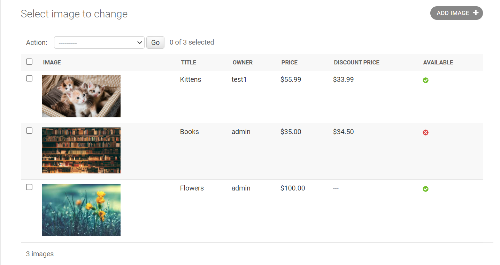
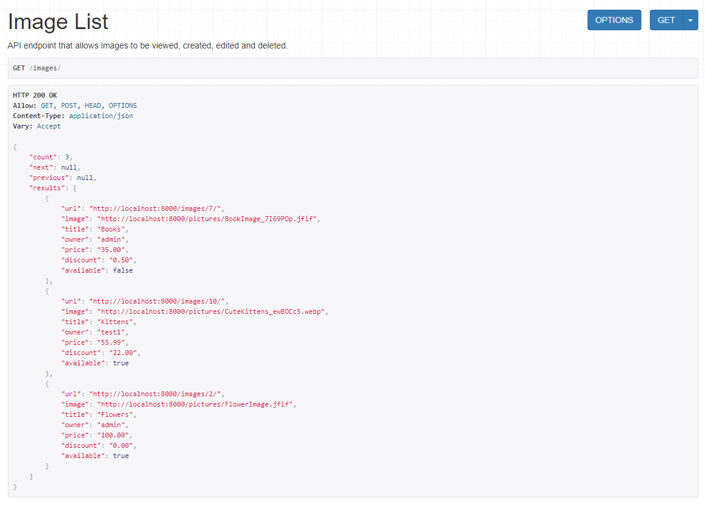
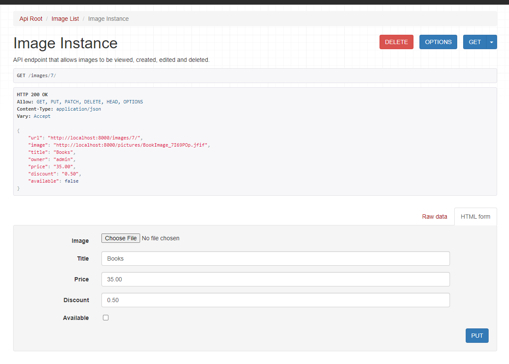
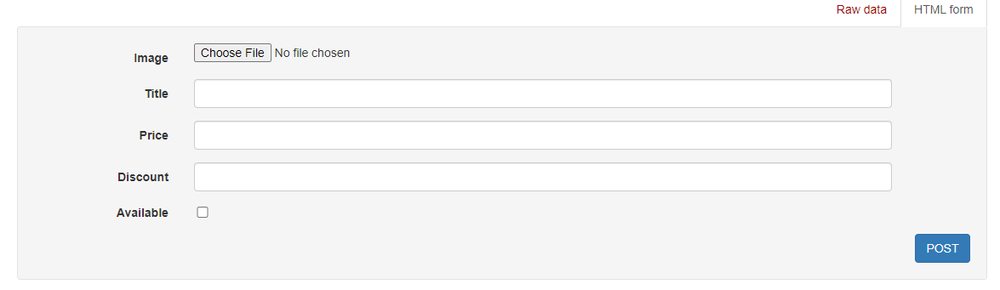

# Image-Repo

Image repository for the Fall 2021 Shopify Developer Intern Challenge. This image repository is built with Django and Django Rest Framework.

# Setup

1. Clone the repo
```
git clone https://github.com/tayadavison/Image-Repo.git
cd Image-Repo
```
2. Install requirements
```
pip install requirements.txt
```
3. Note, the db is not available so to run the user would need to create postgresql db and then update the lines 80-84 in imagerepo/settings.py
```
DATABASES = {
    'default': {
        'ENGINE': 'django.db.backends.postgresql',
        'NAME': '<your-db-name>',
        'USER': '<your-user>',
        'PASSWORD':'<your-password>',
        'HOST': 'localhost'
    }
}
```
4. Migrate db and start project
```
python manage.py migrate
python manage.py runserver
```

Access http://localhost:8000/admin/userImages/image/ for the admin page or http://localhost:8000/ for the API

# Testing
To run all the tests run: 
```
python manage.py test
```

This runs unit tests for the models, views, and permissions.

Individual tests can also be run by specifying the full path the the test class or test:
```
# run the 4 tests in the TestImageModel class
python manage.py test userImages.tests.test_models.TestImageModel 
# run only the testPriceDisplay test case in the TestImageModel class
python manage.py test userImages.tests.test_models.TestImageModel.testPriceDisplay
```

# Components

This website has an API section and an admin page available for superusers to access.

## Admin 
The admin page displays a table with the Image, Title, Owner, Price, Discount Price (if applicable), and availability. It is available at http://localhost:8000/admin/userImages/image/.



Admins can create/edit/delete images from this page.

## API
The root page for the API is available at http://localhost:8000/. This is the default homepage for Django Rest Framework and it displays the 2 api options available: 
- users: http://localhost:8000/users/
- images: http://localhost:8000/images/

The users endpoint is only available for staff users (users that have is_staff=True) and it displays a list of all users or specific details about a user (http://localhost:8000/users/{user-id}/)

The images endpoint can be accessed by anyone, whether they are logged in or not. It displays a list of all images (http://localhost:8000/images/) 



And details about an image (http://localhost:8000/images/{image-id}/). 



If a user is logged in, they will be able to make a POST request to create a new image at http://localhost:8000/images/. The owner of the image is the user who is currently logged in.



If the user is the image owner, in the image details page they will also be able to update the image and delete the image. 


